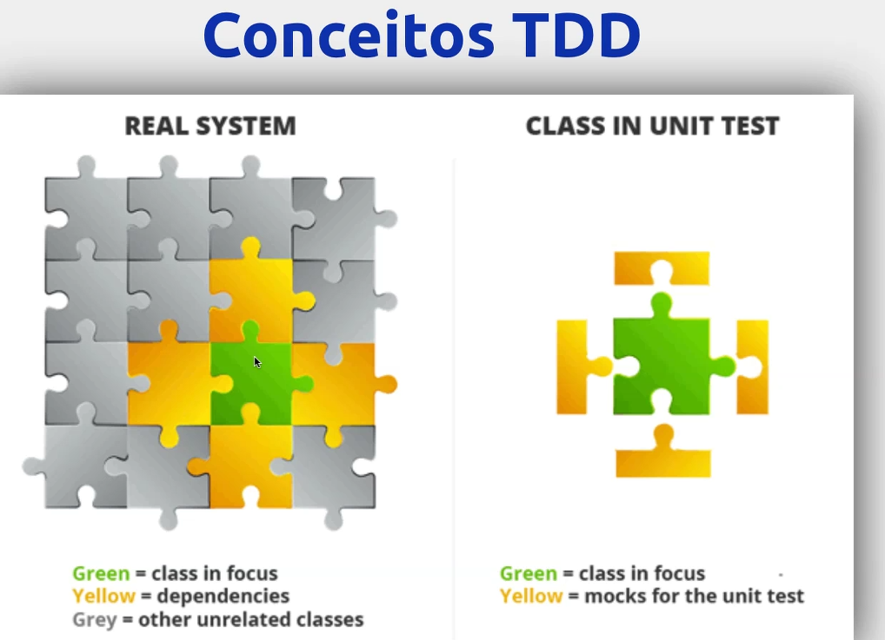
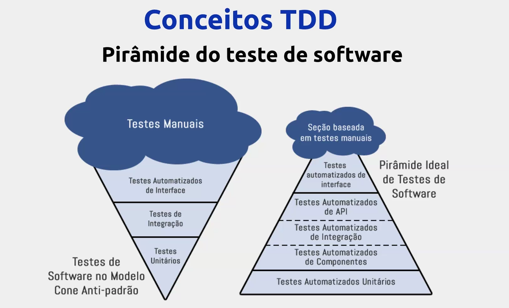
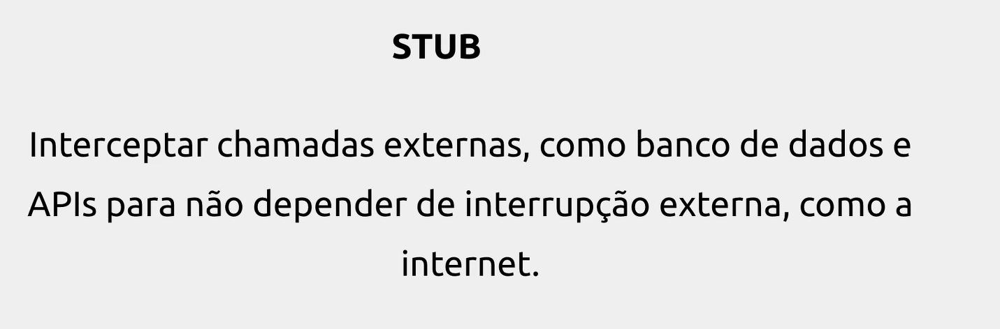
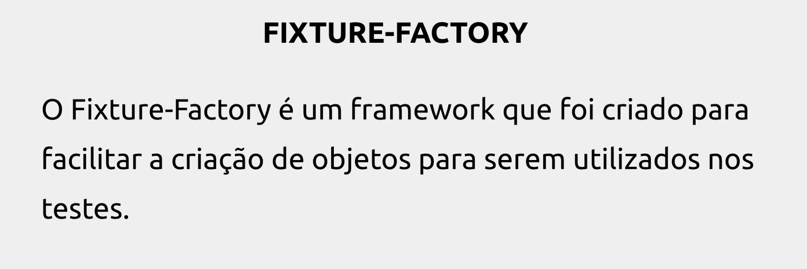
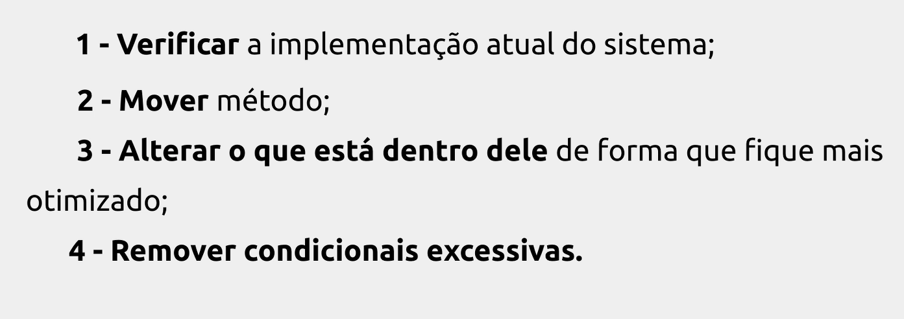

# Bootcamp Java Womakers Code

- Projeto de cadastro de Jedi✅ 
- Gerenciador para testar as forças com os Jedis✅

## Design API

## Tecnologias

- Java8
- SpringBoot
- RestApi
- Richardson Maturity Model

## Richardson Maturity Model

APIs possuem diferentes graus de maturidade em relação às regras mais importantes da arquitetura REST.

Existe uma maneira simples de definir esse grau: o Richardson Maturity Model.

Esta maneira supõe diversas restrições de antemão, visto que algumas delas são intrínsecas a arquitetura 
da web, ainda assim, pode ser uma boa base para classificar sua API.

O modelo possui 4 níveis de maturidade (sendo 0 uma API que não atenda nenhuma das regras), os outros 3 são:

- Nivel 1 :Recursos: A partir do momento em que seja possível fazer requisições de diferentes recursos em diferentes 
endpoints. Sem a necessidade dos chamados query parameters.
- Nivel 2: Verbos HTTP: Aqui, os diferentes métodos HTTP são colocados em prática, em contraposição ao uso quase exclusivo 
do POST no protocolo SOAP. Além disso, cada verbo possui sua utilidade específica: PUT para atualizar, DELETE para excluir,
GET para adquirir e POST para criar. Em alguns casos o PATCH também é utilizado.
- Nivel 3: Hypermedia: Os recursos passam a possuir links para recursos relacionados, além de links para 
realizar ações em cima dessas coleções, a partir desse ponto, a API se auto-documenta e possibilita a 
funcionalidade de descoberta.

Cada nível é uma condição para o próximo, ou seja, para uma API possuir nível 3, ela precisa primeiro chegar ao nível 2 e 1.

## Qual a diferença entre API REST e RESTful

Para que uma API seja denominada RESTful, ela precisa de algumas propriedades específicas.

Então a diferença entre API REST e RESTful é somente o cumprimento das exigências que a arquitetura exige.

Podemos dizer que uma Representational State Transfer (REST) é uma abstração da arquitetura da World Wide Web. 
É um estilo arquitetural que consiste de um conjunto coordenado de restrições aplicadas a componentes, 
conectores e elementos de dados dentro de um sistema.

O REST ignora os detalhes da implementação de componente e a sintaxe de protocolo com o objetivo de focar 
nos papéis dos componentes, nas restrições sobre sua interação com outros componentes e na sua interpretação 
de elementos de dados significantes.

## Resumo API e Nível de maturidade

## TDD

- TDD (TEST DRIVEN DEVELOPMENT) é um processo de design de Software;
  - Existem outros tipos de teste: 
    - teste de regressão (teste de stress garantir que tudo funciona)
    - testes automatizados(muito importante, realizados por QAS)
    - testes de unidade(valida funcionalidade dos métodos que criamos)
    - Teste de Integração (garantir que o lado A e lado B estão conversando)

## Conceitos TDD : Ciclos de testes no desenvolvimento

- Escrever testes
- ver o teste falhar
- Escrever o código
- Ver o teste passar
- Refatorar

## Piramide do teste de Software

## Erros mais comuns de quem está começando

- Codar antes de testar
- Não usar ferramenta de Mock
- Não começar com cenários de erro
- Confundir ferramenta com prática(estudar mockito, JUnit)
- Pular a etapa de refatorar a implementação;

## Codar antes de testar

AAA Pattern
- Arrange: Configuração do cenário, por exemplo: criando os dados de entrada;
- Act: executando a ação/método;
- Assert: Validação do que vai vir;

## Não mockar resultados

Existem padrões que nos ajudam a mockar com mais segurança como:
- Stub
- .
- .

mockito é o nome da biblioteca, mock é?

## Quando usar mock e stubs?

## Notion apontamentos Ana

[CONHECENDO O UNIVERSO DAS APIS](https://humane-knee-224.notion.site/Conhecendo-o-universo-das-API-s-ab4f34ef29384245b41e0c052da430d2)
